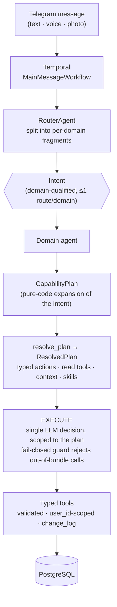

<div align="center">

# ai-daybook

**A production life-logging system: eleven long-lived LLM agents on Temporal, where the
model gets exactly one decision per request — inside a boundary computed in advance by
ordinary code.**

**[▶ Live demo](https://ai-daybook.cc/app/demo.html)** · synthetic data, best on a phone

</div>

---

**The three things worth your next thirty seconds:**

- **One LLM decision, pre-scoped.** An intent expands into a `CapabilityPlan` by pure code.
  An out-of-bundle tool call is `FAILED_TERMINAL` with no partial writes — checked against
  the *plan*, so "no partial writes" is structural rather than a rollback.
  → [chapter 02](docs/02-agent-architecture.md)
- **An LLM writes free-form SQL against production, safely.** `sqlglot` AST validation, a
  role holding no write grant, and Postgres row-level security. Defeating any one of the
  three buys nothing. → [chapter 04](docs/04-security.md)
- **338 eval cases, 52 deterministic evaluators, no judge model, threshold 1.0, no
  retries.** Every number here ships with the command that produced it.
  → [chapter 06](docs/06-quality.md)

Built and operated by one person. What that means for the numbers below is
[chapter 08](docs/08-engineering-process.md).

---

## Who it is for, and why that shaped the architecture

Every conventional self-tracking tool charges, as its price of entry, exactly the capacity
that is scarce: habit trackers demand streaks, food diaries demand precise quantities, task
managers demand that the plan already exists. For people with ADHD or autism — the users
this is built for — that is not a minor friction. It is the disability itself, presented as
a signup form.

## The product

You text it the way you'd text a friend:

```text
you ▸ morning run, 5k. then an omelette and coffee. remind me tomorrow
      at 9 to book the dentist — oh, and I'm out of whey protein

router ▸ 4 fragments · 4 domains · dispatched concurrently

   🏃 ActivityAgent   run · 5 km · morning            → activities
   🍳 FoodAgent       omelette + coffee ≈ 430 kcal    → meals (estimated, no questions)
   ⏰ PlanningAgent   "book dentist" tomorrow 09:00   → durable Temporal timer
   📦 InventoryAgent  whey protein → running low      → inventory
```

Four typed, audited, user-scoped database writes. No forms, no follow-up interrogation.

Three values carry the product:

1. **Zero-friction capture.** One line, mixing domains freely, by voice or photo. A thought
   that has to wait for a form is already gone.
2. **Accumulate everything, ask for nothing.** Screen time, Wi-Fi places, and workouts
   arrive automatically and join what you typed. The value grows without the effort growing.
3. **The analysis is the agent's job.** Cross-domain correlation and resurfacing at the
   moment of relevance, so noticing does not depend on remembering to look.

And one constraint that outranks all three: **no streaks, no guilt, gaps are normal.** The
working criterion is that the system must be worth opening after a three-week gap. Anything
that punishes absence is designed against its own users.

## Product decisions become system constraints

Each value above translates into a specific architectural commitment — and those
commitments are what the rest of this repository is about.

| Product value | System constraint |
|---|---|
| Zero-friction capture | The router splits one mixed message into per-domain fragments and estimates common inputs without asking. |
| Accumulate everything | Durable ingest, with idempotency at every external boundary and every durable effect. |
| Analysis is the agent's job | Free-form cross-domain SQL, parsed with `sqlglot` and executed under a read-only role with row-level security. |
| Worth opening after a gap | The database is the source of truth; the chat is a persisted mirror, never a queue. |

## How it works

The core idea: the LLM gets **exactly one** decision per request, inside a pre-computed,
fail-closed boundary. Everything around that decision is deterministic code.



An out-of-bundle decision is rejected outright: `FAILED_TERMINAL`, no partial writes.
Unsupported intents never reach a model at all — they take a deterministic fallback.

## By the numbers

Measured at one pinned commit. Every figure ships with the command that produced it, in
[chapter 06](docs/06-quality.md#how-these-were-counted) — so if you want one re-run live in
an interview, it takes ten seconds.

| | |
|---|---|
| Agents | **11** — ten domain agents plus a router |
| Durable Temporal workflows | **20** |
| Alembic migrations | **97** |
| Tests | **8,307** — 7,599 Python, 708 frontend |
| Test-to-production code | **1.71×** — 282k lines of tests against 165k of Python |
| Eval cases | **338** across 11 agents, run against **5** models |
| Deterministic evaluators | **52** |
| Design and plan documents | **212** |

These are the output of one person **directing AI implementers**, not of one person typing.
That is the point rather than a caveat: the numbers below the line — 52 deterministic
evaluators, a merge gate at threshold 1.0 with no retries, `mypy --strict` over the tests
themselves — are the apparatus that makes the numbers above the line trustworthy. How that
direction works is [chapter 08](docs/08-engineering-process.md).

## Read on

If you read two, read **02** and **06**.

| | |
|---|---|
| [01 · Product](docs/01-product.md) | Audience, use cases, and the UX decisions that carry it |
| **[02 · Agent architecture](docs/02-agent-architecture.md)** | The capability model and the fail-closed boundary |
| [03 · Durable execution](docs/03-durable-execution.md) | Temporal, idempotency, provider failover |
| [04 · Security](docs/04-security.md) | Guarded SQL, row-level security, typed effects |
| [05 · Data model](docs/05-data-model.md) | The lifelog schema, audit trail, derived episodes |
| **[06 · Quality](docs/06-quality.md)** | The eval gate, the test tiers, the counting rules |
| [07 · Operations](docs/07-operations.md) | Deploy, rollback, observability, cost ledger |
| [08 · Engineering process](docs/08-engineering-process.md) | How the work is directed and verified |
| [09 · Roadmap](docs/09-roadmap.md) | What is designed, planned, and deliberately not built yet |

## Stack

| Layer | Choice |
|---|---|
| Language | Python 3.13, strictly typed (`mypy --strict` + `pyright`, over source *and* tests) |
| Durable execution | [Temporal](https://temporal.io) |
| Agents | [LangGraph](https://github.com/langchain-ai/langgraph) + [PydanticAI](https://ai.pydantic.dev), inside Temporal activities |
| LLM providers | Subscription-backed Claude via `claude_cli`, with multi-provider failover |
| API & admin | FastAPI, SQLAdmin |
| Persistence | PostgreSQL, async SQLAlchemy 2.0, Alembic |
| SQL guard | [`sqlglot`](https://github.com/tobymao/sqlglot) + Postgres row-level security |
| Messaging | aiogram, Telegram webhook |
| Mini App | React + Vite SPA, served by nginx |
| RAG | `fastembed`, local and in-memory |
| Integrations | Google Calendar, OpenFoodFacts, barcode decoding (`zxing-cpp`), voice transcription |
| Observability | Sentry (including `gen_ai` spans), Langfuse for cost and latency |
| Infra | Docker Compose, GHCR images, self-hosted deploy runner |

## Rights

This is a case study, not an open-source release. The implementation repository is private;
the excerpts here are illustrative and are not a distribution. All rights reserved.
© 2026 Mikhail Nezhinsky.

---

<sub>Snapshot of commit `2c683ad5`, 2026-08-13. The private repository has moved on since;
figures here are not updated continuously.</sub>
