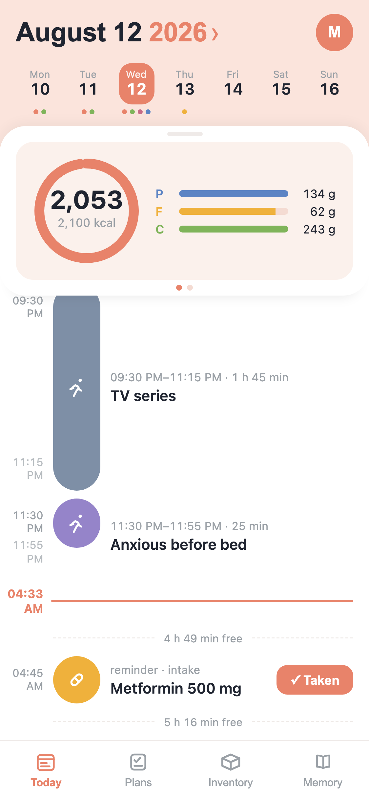
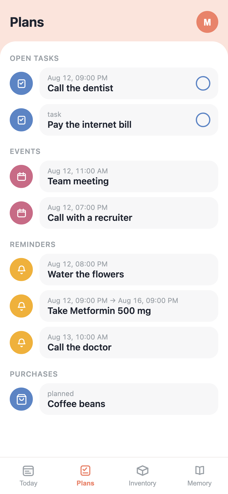
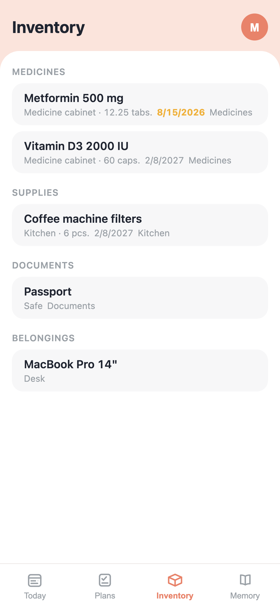
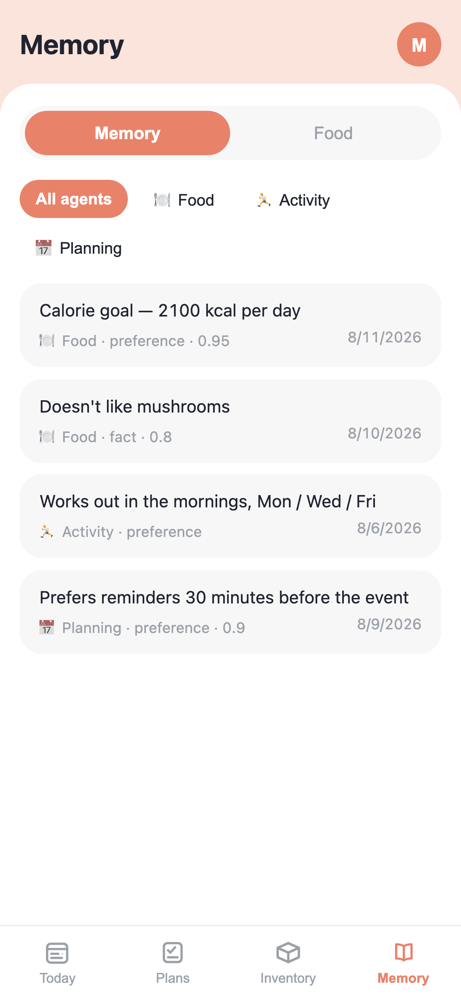

# 01 · Product

[← back to the overview](../README.md)

**[▶ Try the live demo](https://ai-daybook.cc/app/demo.html)** — synthetic data, no account
needed. Best on a phone; the interface is built for a 375-wide viewport.

---

## Who it is for

People whose executive function is the bottleneck — primarily ADHD and autistic users. That
is a positioning decision, and it shapes the engineering rather than just the tone.

If capture has to survive an ADHD working-memory window, then it cannot involve a form,
because a thought that waits for a form is gone. If the system must stay useful for someone
whose engagement collapses for three weeks at a time, then streaks and guilt mechanics are
not merely unfashionable — they actively select against the user you built it for. If a user
has difficulty naming an internal state, then a controlled emotion vocabulary and derived
episodes are not a data-modelling convenience; they are the feature.

The design brief that follows from this is narrow and unusually strict:

- **Capture must cost nothing.** One line, mixed domains, voice or photo. No clarifying
  question unless ambiguity would genuinely make the record useless.
- **Absence must be free.** No streaks, no scolding, no "you haven't logged in 12 days".
  The working criterion: the product must be worth opening after a three-week gap.
- **The system does the noticing.** Correlation across domains and resurfacing at the
  moment of relevance, because relying on the user to remember to look reintroduces the
  exact deficit the product exists to compensate for.

## The interface you actually use

Telegram. You text it like a friend, and the routing happens behind the message.

```text
you ▸ morning run, 5k. then an omelette and coffee. remind me tomorrow
      at 9 to book the dentist — oh, and I'm out of whey protein

router ▸ 4 fragments · 4 domains · dispatched concurrently

   🏃 ActivityAgent   run · 5 km · morning            → activities
   🍳 FoodAgent       omelette + coffee ≈ 430 kcal    → meals (estimated, no questions)
   ⏰ PlanningAgent   "book dentist" tomorrow 09:00   → durable Temporal timer
   📦 InventoryAgent  whey protein → running low      → inventory
```

Voice messages are transcribed. Meal photos are recognized. Barcodes are decoded and looked
up against OpenFoodFacts. None of that requires choosing a mode first.

## The visual surface

A Telegram Mini App — a React SPA — is the reading surface. Capture stays in chat; the app
is where accumulated data becomes legible.

| | |
|---|---|
|  |  |
| **Today.** One timeline across every domain, with the calorie ring and macros above it. Gaps are labelled rather than hidden — "4 h 49 min free" is information, not empty space. The medication reminder carries an inline **✓ Taken** that decrements the linked inventory item. | **Plans.** Tasks, calendar events, reminders, and planned purchases in one agenda. A recurring reminder shows its series window rather than pretending to be a single event. |
|  |  |
| **Inventory.** Possessions, supplies, and medicines with quantities that write back when a dose is approved from the timeline. | **Memory.** What the agents have learned and retained about you, per agent — readable and deletable, not a black box. |

## The decisions worth stealing

**The day starts at 05:00, not midnight.** A meal logged at 01:00 belongs to the day that
just ended, because that is how people actually think about "today". The boundary follows
the profile timezone and is computed deterministically inside the workflow rather than read
from a clock at read time. This is one setting, and it removes an entire category of "why is
my Tuesday wrong" confusion.

**Estimating beats interrogating.** "Omelette and coffee" resolves to a plausible calorie
and macro estimate immediately. It is not precise. Precision was never the goal — the goal
is that the record exists at all, because a user who is asked "how many grams of butter?"
logs nothing and stops opening the app. Corrections are cheap and audited; missing data is
not recoverable.

**Every record keeps what you actually said.** `raw_input` is preserved next to the parsed
fields, so a bad interpretation is always traceable to its source and can be re-derived
later. Corrections write a `change_log` entry rather than overwriting history.

**Silence is a feature.** Journal capture answers with a one-line acknowledgement and
nothing else. It does not reflect your feelings back at you, offer encouragement, or ask a
follow-up question — with two narrowly defined exceptions, and an explicit crisis-response
contract. An archivist that chats is an archivist you stop writing to.

## What the app does not show yet

Keeper notes, journal entries, and CBT records are fully shipped on the capture side —
typed effect tools, tags, corrections, the note→task handoff, and nine read-only SQL views
over them — and have no Mini App screen. Capture was deliberately sequenced ahead of
presentation. Notes are next; see [chapter 09](09-roadmap.md).

For journal capture specifically, staying chat-only is a product decision rather than a
missing screen.

---

[← back to the overview](../README.md) · [next: agent architecture →](02-agent-architecture.md)
