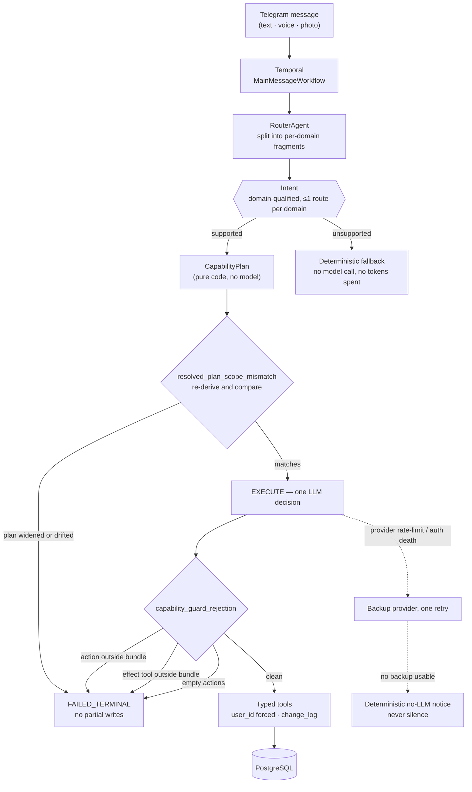

# 02 · Agent architecture

[← back to the overview](../README.md)

The problem this solves: an agent broad enough to be useful across ten life domains is also
broad enough to do something you never authorized. The usual answers — a bigger prompt, a
retry, a validation pass on the output — all treat the model's freedom as given and try to
clean up afterwards.

This system inverts it. The model gets **exactly one** decision per request, and the set of
things that decision may contain is computed in advance, by ordinary code, before the model
is called at all.

## The pipeline

Solid edges are the happy path. What matters is where it *refuses*:



**The router does not solve anything.** It splits a mixed message into fragments, preserves
each verbatim, assigns any attached media to the right fragment, and emits one
domain-qualified `Intent` per fragment. It never writes.

**Pure code expands the intent into a plan.** No model involvement. The expansion is a
lookup over the typed object graph, and it produces a `CapabilityPlan`:

```python
class CapabilityPlan(BaseModel):
    domain: str
    intent: Intent
    skill_fragments: list[str] = Field(default_factory=list)
    allowed_action_kinds: list[str] = Field(default_factory=list)
    allowed_effect_tools: list[str] = Field(default_factory=list)
    read_tools: list[str] = Field(default_factory=list)
    context_blocks: list[str] = Field(default_factory=list)
```

<sub>`src/app/agents/capability/plan.py`</sub>

Fifteen lines, seven lists of strings. That is the entire contract between the code and the
model, and its shape is the reason the rest works: a plan that is serializable is also
diffable, loggable, snapshot-testable, and comparable field by field. `resolve_plan` then
rehydrates it into a `ResolvedPlan` of real typed objects — `Action`, `ReadToolSpec`,
`ContextBlockSpec`, skill fragments — and only those objects are wired into the model call.

**One LLM decision.** EXECUTE happens once, scoped to that plan. It is the only call in the
system that can authorize a write.

## The layer between the plan and the guard

Plan-then-guard has a gap in it: the guard checks the decision against *whatever plan it was
handed*. A plan that arrived widened — from a caller, a cache, a refactor, a
deserialization — passes a guard that is doing its job perfectly.

So the plan is checked too. `resolved_plan_scope_mismatch` re-derives the canonical plan from
the intent alone and compares it against the one in hand, field by field:

```python
def resolved_plan_scope_mismatch(actual: ResolvedPlan, expected: ResolvedPlan) -> str | None:
    if actual.domain != expected.domain:
        return f"plan_domain:{actual.domain}:expected_domain:{expected.domain}"
    if actual.intent != expected.intent: ...
    if actual_skill_fragments != expected_skill_fragments: ...
    if actual.skill != expected.skill: ...                    # the composed prompt itself
    if actual.action_kinds != expected.action_kinds: ...
    if actual.allowed_effect_tools != expected.allowed_effect_tools: ...
    if actual_read_tools != expected_read_tools: ...
    if actual_context_blocks != expected_context_blocks: ...
    # Last resort: catches plan drift not explained by any specific check above
    # (e.g. reordered serialized lists or a new CapabilityPlan field).
    if actual.plan.model_dump(mode="json") != expected.plan.model_dump(mode="json"):
        return "plan_serialized_mismatch"
    return None
```

<sub>[`code/src/app/agents/capability/resolve.py`](../code/src/app/agents/capability/resolve.py)
· abridged; every check returns a distinct diagnosable string</sub>

Each specific check exists to produce a *readable* failure. The closing `model_dump`
comparison exists because a guard that only knows the failure modes you anticipated has an
expiry date.

That last clause is not hypothetical. Smuggling one extra tool into a serialized plan's
`allowed_effect_tools` is caught by **`plan_serialized_mismatch` and by nothing else** — the
resolved effect-tool set is derived from the resolved actions, so the specific check compares
two identical sets while the underlying plans differ. [The evidence page runs
it](EVIDENCE.md#4-the-plan-scope-check-exercised).

## The guard

This is the load-bearing piece, and it is deliberately small enough to read in full:

```python
def capability_guard_rejection(
    actions: list[Any],
    planned_tool_calls: list[PlannedToolCall],
    resolved: ResolvedPlan,
    *,
    allow_empty: bool = False,
) -> str | None:
    """Reject any action kind or effect tool outside the scoped capability bundle."""
    if not actions:
        return None if allow_empty else "empty_actions"

    allowed_actions = set(resolved.action_kinds) | UNIVERSAL_ACTION_KINDS
    for action in actions:
        kind = getattr(action, "kind", None)
        if not isinstance(kind, str) or kind not in allowed_actions:
            return f"disallowed_action:{kind}"

    allowed_tools = set(resolved.allowed_effect_tools)
    for call in planned_tool_calls:
        if call.tool_name not in allowed_tools:
            return f"disallowed_effect_tool:{call.tool_name}"

    return None
```

<sub>[`code/src/app/agents/common/guard.py`](../code/src/app/agents/common/guard.py) · the
whole file, 36 lines including imports</sub>

A rejection is terminal: `FAILED_TERMINAL`, **no partial writes**. Not a retry, not a
repair, not a "let me try that again with a stricter prompt". The run ends and the user gets
a deterministic message. [Watch it reject real
input](EVIDENCE.md#3-the-guard-exercised).

Two barriers, not one. An action kind can be legitimate while the tool call it carries is
not, so both are checked — and `UNIVERSAL_ACTION_KINDS` (today just `ask_user`) is a property
read off the `Action` object, not a special-cased string inside the guard.

Three properties are worth naming:

1. **It fails closed by construction.** The allow-list is the plan. There is no path where
   an unlisted tool is reachable, because unlisted tools are never attached to the model
   call in the first place — the guard is the second line, not the first.
2. **It is checked before execution, not after.** `planned_tool_calls` are inspected as a
   plan. Nothing has touched the database when the rejection happens, so "no partial
   writes" is a structural fact rather than a rollback.
3. **An unsupported intent never reaches a model.** It takes a deterministic, no-LLM
   fallback path and answers without spending a token.

## What the model actually sees

The plan decides what *may* happen. The prompt decides what the model knows while deciding.
Four things are assembled, and each is bounded on purpose:

- **Skill fragments** — the domain instructions for this intent specifically, not the whole
  agent's manual. An intent that cannot create a recipe never sees the recipe rules.
- **Context blocks** — typed, individually resolved, and **fail-soft**: a block that cannot
  load leaves its section out rather than failing the run. A food decision gets recent
  product usage; a correction gets the recent records that could plausibly be the target,
  so "change that" resolves without a lookup round trip.
- **Tool schemas** — only the tools in the bundle. This is why the guard is the second line
  of defence rather than the first: an unlisted tool is not described to the model at all.
- **Conversation history, bounded** — the router receives explicitly pinned targets plus ten
  global turns; a domain agent receives the same targets plus ten turns it actually
  participated in. Older turns are compacted into structured summaries built from immutable
  revisions with explicit folded membership, so a slow or failed summary degrades into raw
  overflow rather than a silent gap in what the model knows.

The context blocks are rendered sequentially against one shared session rather than gathered
concurrently — an attempt to parallelize them is the obvious optimization and it is the
wrong one here, because they share the session that scopes them.

## Why typed objects rather than strings

Tools, skills, actions, capabilities, intents, and context blocks are Python objects
referenced directly. Registries are derived from that object graph, never hand-maintained
alongside it. Strings appear only at serialization boundaries.

The practical consequence: a wiring mistake — an action that no agent can emit, a tool
referenced by a capability that does not exist — fails at import or type-check time. The
alternative, a string-keyed registry, moves that same mistake to runtime, where it surfaces
as a `KeyError` in the middle of someone's conversation. With `mypy --strict` and `pyright`
over both source and tests, the object graph is checked on every commit.

## Isolation between agents

Each of the ten domain agents has its own conversation context, its own long-term memory
(`agent_memories`), and its own tool surface. FoodAgent cannot read PlanningAgent's context
and cannot call its tools — except where a capability bundle deliberately crosses the line,
which is bundle-scoped rather than domain-scoped, so it is a declared exception rather than
an ambient permission.

Request-scoped time is passed in explicitly as a `UserTimeContext`, captured deterministically
via `workflow.now()`. An agent never reads the wall clock; "today" is a value it is given, in
the user's timezone, on the 05:00 boundary.

---

[← product](01-product.md) · [next: durable execution →](03-durable-execution.md)
